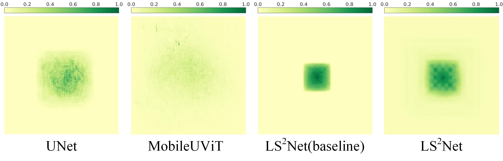
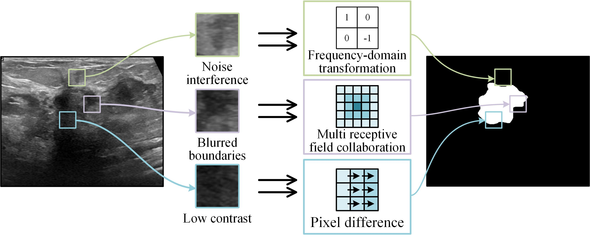

# LS2Net: A Lightweight Segmentation Network for Ultrasound Imaging via Synergy of Large and Small Receptive Fields
Code will be made available upon paper acceptance

## Deleted Content from Introduction

The following figures were removed from the Introduction section of the manuscript solely to comply with the IEEE Regular Paper page limit. They are preserved here for editorial reference.

### Figure 1 — Effective Receptive Field (ERF) Visualization

 

<i>
<b>Figure 1.</b> Visualization of the Effective Receptive Fields (ERF) across different methods reveals distinct characteristics. U-Net (CNN-based) exhibits a blurred and highly localized receptive field, whereas MobileUViT (Transformer-based) shows a dispersed and weak response. LS$^2$Net (baseline) achieves a more concentrated yet limited receptive field. In contrast, the full LS$^2$Net model produces a clearer and more balanced ERF distribution, effectively capturing both local details and global context, thereby demonstrating superior feature modeling capability. We take the central response of the output feature map as the target and compute its gradient distribution with respect to the input pixels via backpropagation to characterize the contribution of different regions. The results are then averaged across multiple samples and normalized using logarithmic scaling to obtain a stable estimation of the effective receptive field (ERF). Furthermore, by measuring the minimal high-contribution coverage ratios under different thresholds (20%, 30%, 50%, and 99%), we quantitatively compare the spatial modeling capability of different models.</i>

 

<i>Removed from the main manuscript to comply with the IEEE Regular Paper page limit.</i>

 

---

### Figure 2 — Challenges in Ultrasound Image Segmentation

 

<i>
<b>Figure 2.</b> Challenges in ultrasound image segmentation and the targeted design of LS$^2$Net for balancing accuracy and computational efficiency.
</i>

 

<i>Removed from the main manuscript to comply with the IEEE Regular Paper page limit.</i>

 

---
