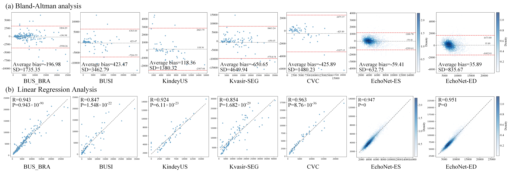
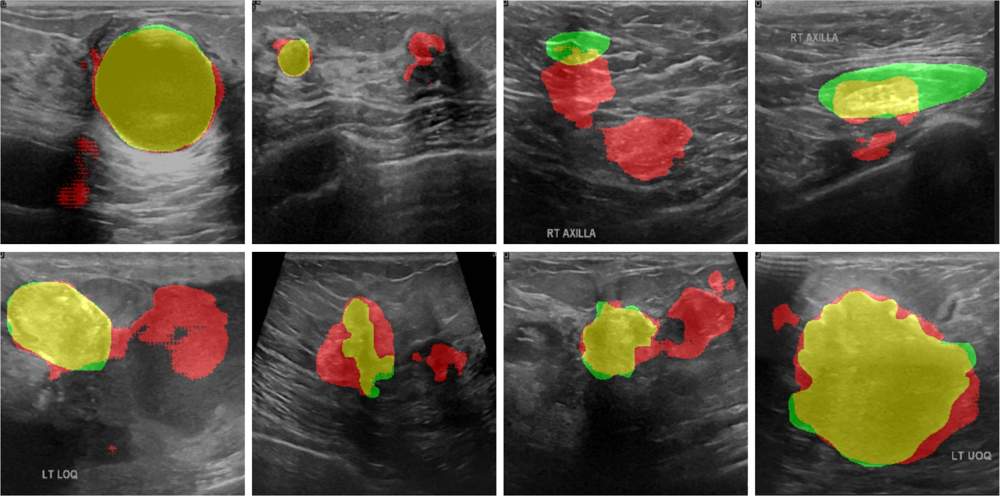

# LS$^2$Net: A Lightweight Segmentation Network for Ultrasound Imaging via Synergy of Large and Small Receptive Fields

**Code will be made available upon paper acceptance.**

## Supplementary Analyses and Additional Materials Removed from the Main Manuscript

This repository provides supplementary analyses, figures, tables, and discussions that were removed from the main manuscript solely to comply with the IEEE Regular Paper page limit. These materials are preserved here for editorial reference and provide additional analysis, visualization, and discussion supporting the design, effectiveness, generalization, and limitations of LS$^2$Net.

The removal of these materials does not affect the core methodology, experimental results, or conclusions presented in the main manuscript.

---

## I. Supplementary Materials from the Introduction

### 1. Effective Receptive Field (ERF) Analysis

**Original location:**
Section I, **Introduction**, immediately after the discussion motivating the collaborative use of large and small receptive fields.

**Supplementary material:**
`Figure/ERF.jpg`

This figure provides a visual and quantitative comparison of the effective receptive fields (ERFs) of different segmentation architectures, including U-Net, MobileUViT, the LS$^2$Net baseline, and the complete LS$^2$Net model.

The analysis demonstrates the distinct receptive-field characteristics of CNN-, Transformer-, and LS$^2$Net-based architectures. U-Net exhibits a highly localized and blurred response, while MobileUViT produces a more dispersed and relatively weak response. The LS$^2$Net baseline provides a more concentrated response but remains limited in spatial coverage. By jointly incorporating large and small receptive fields, the complete LS$^2$Net achieves a more balanced ERF distribution, enabling both local detail modeling and broader contextual perception.

To obtain the ERF, the central response of the output feature map is selected as the target, and its gradient with respect to the input pixels is computed through backpropagation. The gradient distributions are averaged across multiple samples and normalized using logarithmic scaling to obtain a stable ERF representation. In addition, the minimum high-contribution coverage ratios under different thresholds (20%, 30%, 50%, and 99%) are measured to quantitatively characterize the spatial modeling capability of different architectures.

 

<i>
<b>Figure S1.</b> Effective Receptive Field (ERF) visualization across different segmentation architectures. The results demonstrate that LS$^2$Net achieves a more balanced receptive-field distribution by jointly modeling local details and global contextual information.
</i>

---

### 2. Challenges in Ultrasound Image Segmentation

**Original location:**
Section I, **Introduction**, in the discussion of the challenges associated with ultrasound image segmentation.

**Supplementary material:**
`Figure/challenge.jpg`

This figure provides a visual summary of the major challenges encountered in ultrasound image segmentation and the corresponding design objectives of LS$^2$Net. These challenges include speckle noise, low contrast, blurred boundaries, and the need to balance segmentation accuracy with computational efficiency.

The figure further illustrates how the proposed LS$^2$Net addresses these challenges through its lightweight architecture and collaborative receptive-field design, which jointly exploit local and global information for more robust feature representation.

 

<i>
<b>Figure S2.</b> Challenges in ultrasound image segmentation and the corresponding design objectives of LS$^2$Net.
</i>

---

## II. Supplementary Materials from Related Work

### 3. Discussion of the Limitations of Local Receptive Fields

**Original location:**
Section II, **Related Work** → **Methods with Local Receptive Fields**, at the end of the subsection, following the discussion of ConvNeXt and LKSNeXt.

The following discussion was removed from the main manuscript:

> However, conventional convolution operations are inherently limited in receptive field, and large-kernel convolutions often saturate in performance before achieving a truly global receptive field, frequently requiring deep network stacking to further expand the receptive field and achieve high performance.

This supplementary discussion highlights the limitations of conventional convolution-based architectures in modeling long-range dependencies. Although large-kernel convolutions can expand the receptive field, their ability to provide truly global contextual modeling remains limited, and further expansion may require deeper network architectures.

This observation motivates the exploration of complementary receptive-field modeling strategies in LS$^2$Net.

---

### 4. Discussion of the Limitations of Global Receptive Fields

**Original location:**
Section II, **Related Work** → **Methods with Global Receptive Fields**, at the end of the subsection, following the discussion of BRAUNet++ and MCBTNet.

The following discussion was removed from the main manuscript:

> However, despite their excellent global modeling abilities, both Transformers and Mamba have limitations. The self-attention mechanism in Transformers incurs quadratic computational complexity, resulting in substantial overhead, while structural characteristics of Mamba lead to slower inference speed. These constraints make both architectures challenging to deploy in clinical environments with limited computational resources \cite{tang2025mobile}.

This supplementary discussion emphasizes the computational considerations associated with global receptive-field architectures. Although Transformers and Mamba-based models provide strong global contextual modeling, their computational and inference characteristics can present challenges for lightweight and real-time clinical deployment.

---

### 5. Comparison of the Advantages of Different Methods

**Original location:**
Section II, **Related Work** → **Methods with Hybrid Receptive Fields**, after the discussion of MSCWNet and before **Ultrasound Image Segmentation**.

The following comparison table was removed from the main manuscript:

| Model               | MSRFS |   NS  |  LCFE |   BR  |   LW  |
| ------------------- | :---: | :---: | :---: | :---: | :---: |
| UNet                |       |       |       |       |       |
| ATT-UNet            |       |       |       |       |       |
| AAU-Net             |   ✓   |       |       |       |       |
| Swin-UMamba         |   ✓   |       |       |       |       |
| Dilated Transformer |   ✓   |   ✓   |   ✓   |       |       |
| TransFSM            |       |       |       |   ✓   |       |
| ANNet               |   ✓   |   ✓   |       |       |       |
| BRAUNet++           |   ✓   |       |       |       |       |
| MCBTNet             |   ✓   |       |       |       |       |
| APFormer            |   ✓   |   ✓   |       |       |   ✓   |
| MobileUViT          |   ✓   |       |       |       |   ✓   |
| BLENet              |   ✓   |   ✓   |       |       |   ✓   |
| PMFSNet             |   ✓   |       |       |       |   ✓   |
| **LS$^2$Net**       | **✓** | **✓** | **✓** | **✓** | **✓** |

**Abbreviations:**

* **MSRFS:** Multi-scale Receptive Field Synergy
* **NS:** Noise Suppression
* **LCFE:** Low-Contrast Feature Extraction
* **BR:** Boundary Refinement
* **LW:** Lightweight Design

The table provides an additional qualitative comparison of the major design characteristics of representative segmentation methods. LS$^2$Net integrates multiple complementary objectives, including multi-scale receptive-field modeling, noise suppression, low-contrast feature extraction, boundary refinement, and lightweight design.

---

### 6. Discussion of Existing Ultrasound Segmentation Methods and LS$^2$Net Motivation

**Original location:**
Section II, **Related Work** → **Ultrasound Image Segmentation**, immediately after the discussion of BLENet and before the discussion of clinical generalization.

The following discussion was removed from the main manuscript:

> However, these methods primarily rely on enlarging the receptive field to process ultrasound images, with the core objective of enhancing feature extraction. They do not explicitly address the fundamental challenges of ultrasound imaging, including speckle noise, low contrast, and blurry boundaries. Simply improving feature extraction is insufficient to balance segmentation performance and computational efficiency. More importantly, such approaches struggle to generalize effectively in real-world clinical environments characterized by multi-center data, heterogeneous devices, and diverse imaging conditions. To this end, LS$^2$Net conducts a systematic analysis of the key challenges in ultrasound imaging and introduces targeted design strategies within the network architecture. Specifically, it enables effective noise suppression, discriminative feature extraction under low-contrast conditions, and refined boundary delineation. By doing so, LS$^2$Net achieves a favorable trade-off between segmentation accuracy, computational efficiency, and model lightweightness.

This supplementary discussion further clarifies the motivation behind LS$^2$Net by connecting the limitations of existing ultrasound segmentation methods with the specific design objectives of the proposed architecture.

---

## III. Supplementary Materials from Experiments and Results

### 7. Bland–Altman and Linear Regression Analysis

**Original location:**
Section IV, **Experiment and Results** → **Comprehensive Analysis of LS$^2$Net** → **Analysis of Binary Segmentation**.

**Supplementary material:**
`Figure/BAB_Analysis.jpg`

**LaTeX label:**
`fig:bab`

This supplementary analysis evaluates the agreement and correlation between LS$^2$Net predictions and ground-truth segmentation masks across multiple binary segmentation datasets.

For the Bland–Altman analysis, the number of foreground pixels in the predicted and ground-truth masks is used as an estimate of the corresponding target region area. The difference between prediction and ground truth is analyzed against their mean values to assess systematic bias and agreement.

For the linear regression analysis, the predicted and ground-truth foreground pixel counts are compared using Pearson's correlation coefficient and the corresponding statistical significance. The results demonstrate strong correlations across the evaluated datasets, providing additional evidence for the stability and generalization capability of LS$^2$Net.

 

<i>
<b>Figure S3.</b> Bland–Altman and linear regression analyses between LS$^2$Net predictions and ground truth across multiple binary segmentation datasets. (a) Bland–Altman analysis evaluates agreement and systematic bias. (b) Linear regression analysis evaluates the correlation between predicted and ground-truth target areas.
</i>

#### Quantitative Results

The Bland–Altman analysis yielded the following bias and standard deviation values:

| Dataset      |    Bias |      SD |
| ------------ | ------: | ------: |
| BUS_BRA      | -196.98 | 1735.35 |
| BUSI         | -423.47 | 3462.79 |
| KidneyUS     |  118.36 | 1380.32 |
| Kvasir-SEG   | -650.65 | 4619.40 |
| CVC-ClinicDB | -425.89 | 1480.23 |
| EchoNet-ED   |   35.98 |  835.67 |
| EchoNet-ES   |  -59.41 |  632.75 |

The corresponding Pearson correlation coefficients are:

| Dataset      |     R |            P-value |
| ------------ | ----: | -----------------: |
| BUS_BRA      | 0.943 |  9.43 × 10$^{-90}$ |
| BUSI         | 0.847 | 1.548 × 10$^{-22}$ |
| KidneyUS     | 0.924 |  6.11 × 10$^{-23}$ |
| Kvasir-SEG   | 0.854 | 1.682 × 10$^{-29}$ |
| CVC-ClinicDB | 0.963 |  8.76 × 10$^{-36}$ |
| EchoNet-ED   | 0.951 |                  0 |
| EchoNet-ES   | 0.947 |                  0 |

Overall, the relatively small biases and strong positive correlations indicate good agreement between LS$^2$Net predictions and ground-truth segmentation areas across different datasets.

---

### 8. Failure Case Analysis

**Original location:**
Section IV, **Experiment and Results** → **Cross-Dataset Evaluation**, following the discussion of the generalization results on colorectal datasets.

**Supplementary material:**
`Figure/faile_case.jpg`

**LaTeX label:**
`fig:fail`

 

<i>
<b>Figure S4.</b> Representative failure cases of LS$^2$Net caused by frequency aliasing.
</i>

### Analysis

Although LS$^2$Net achieves promising segmentation performance across multiple datasets, some challenging cases remain difficult to segment accurately. As illustrated in Fig. S4, representative failure cases are observed on the BUSI dataset.

One possible factor is frequency aliasing introduced during the spatial–frequency interaction process. Operations such as convolution, downsampling, and frequency-domain transformation may produce aliasing when high-frequency components exceed the effective sampling limit. After transformation back to the spatial domain, such aliasing may appear as structural artifacts or abnormal textures.

These artifacts can interfere with feature extraction and may be incorrectly interpreted as anatomical structures. Consequently, local structural inconsistencies, inaccurate boundary localization, and regional mis-segmentation may occur.

This analysis also suggests potential directions for future improvement. Adaptive frequency-band selection or learnable frequency weighting could be introduced to suppress unreliable high-frequency components. Frequency-domain consistency constraints or regularization could further improve the stability of feature representations between spatial and frequency domains.

---

## IV. Supplementary Materials from Discussion and Conclusion

### 9. Overall Summary of LS$^2$Net

**Original location:**
Section V, **Discussion and Conclusion**, at the beginning of the section.

The following summary was removed from the main manuscript:

> Ultrasound imaging, as a widely used medical imaging modality, is applied for the diagnosis of multiple organs and systems throughout the body. To meet the growing clinical demands for accuracy, efficiency, and versatility, modern ultrasound systems are increasingly integrating multiple AI-assisted functions (lesion segmentation). However, deploying these segmentation models directly within ultrasound machines (on-device) for real-time inference is challenging due to the constraints of computational resources, memory capacity, and power consumption. Therefore, developing lightweight and efficient network architectures is essential. To address this need, we propose LS$^2$Net, a lightweight medical image segmentation framework that achieves a balance between segmentation accuracy and computational efficiency. The encoder combines global and local receptive fields to capture multi-scale contextual information, while the decoder employs a multi-receptive field fusion strategy to reconstruct fine-grained features at different levels. The LACS module further refines skip connections to preserve boundary details. Benefiting from these architectural designs, LS$^2$Net achieves a favorable trade-off between accuracy and efficiency, delivering state-of-the-art segmentation performance across five medical scenarios and seven datasets, and demonstrating strong generalization ability on four cross-dataset tests, while significantly reducing computational cost without sacrificing segmentation quality.

This supplementary summary provides a concise overview of the motivation, architecture, and overall experimental findings of LS$^2$Net.

---

### 10. On-Device Deployment and Real-Time Clinical Applications

**Original location:**
Section V, **Discussion and Conclusion**, immediately after the overall summary of LS$^2$Net.

The following discussion was removed from the main manuscript:

> LS$^2$Net contains only 0.21M parameters and achieves an inference speed of 96 FPS, making it easily embeddable into ultrasound consoles or portable devices for real-time, on-device segmentation. This capability enables efficient operation directly on the ultrasound platform, allowing real-time segmentation of target regions during image acquisition and substantially enhancing the efficiency and intelligence of ultrasound examinations. Clinically, real-time lesion localization and quantitative visualization during scanning facilitate faster and more accurate diagnosis, which is particularly valuable in emergency, bedside, and primary healthcare settings where computational resources are limited.

This supplementary discussion further explains the potential practical value of the lightweight architecture and high inference speed of LS$^2$Net for real-time ultrasound applications.

---

### 11. Cross-Modality Generalization of the Collaborative Receptive Field Paradigm

**Original location:**
Section V, **Discussion and Conclusion**, following the discussion of real-time on-device deployment.

The following discussion was removed from the main manuscript:

> The collaborative receptive field paradigm integrates multi-scale receptive fields via a multi-branch architecture to jointly model structural and texture information. As it is inherently modality-agnostic, it demonstrates strong cross-modality generalization. In MRI and CT, large receptive fields capture global anatomical structures, while small receptive fields refine local details, enabling effective segmentation across different scales. In histopathology, large receptive fields model tissue-level context, whereas small receptive fields focus on cellular morphology, aligning well with cell-level analysis tasks. Overall, this paradigm provides a unified and flexible framework for multi-scale feature modeling, which can be readily extended to various medical imaging modalities and tasks.

This supplementary discussion explores the potential extension of the collaborative receptive-field paradigm beyond ultrasound imaging. It highlights how complementary receptive fields may be useful for modeling anatomical structures at different spatial scales across MRI, CT, and histopathology.

---

### 12. Clinical Deployment and Future Work

**Original location:**
Section V, **Discussion and Conclusion**, following the discussion of cross-modality generalization.

The following discussion was removed from the main manuscript:

> In real-world clinical settings, imaging devices and computational resources vary significantly across institutions and regions, and the applicability of our model in such diverse environments remains to be further explored. In the future, we plan to deploy LS$^2$Net on edge computing devices and collaborate with clinicians for professional validation to further assess its feasibility and practicality in real-world clinical workflows. Through joint evaluation with medical experts, we aim to investigate the model’s consistency across different disease types, imaging parameters, and operator conditions, thereby confirming its clinical robustness and reliability. Moreover, the generalization capability of LS$^2$Net across various imaging devices and modalities warrants further investigation. We intend to conduct systematic multi-center and multi-device experiments to evaluate its stability and adaptability, enhancing its reliability in diverse clinical scenarios. LS$^2$Net is expected to promote the standardization and generalization of intelligent ultrasound-assisted diagnosis, providing a stable, efficient, and scalable intelligent diagnostic support system for remote areas and primary healthcare institutions.

This supplementary discussion outlines potential future directions, including edge-device deployment, multi-center validation, multi-device evaluation, and clinical assessment with medical experts.

---

### 13. Fine-Grained Feature Processing and Lightweight Decoder Design

**Original location:**
Section V, **Discussion and Conclusion**, at the end of the section.

The following discussion was removed from the main manuscript:

> LS$^2$Net implements fine-grained processing for different types of features, establishing a coarse-to-fine feature handling strategy that enables diversified feature representations. Meanwhile, the RRSC module optimizes skip connections, effectively reducing the computational burden on the decoder and accelerating feature reconstruction. LS$^2$Net provides a novel approach for lightweight segmentation models that balance performance and speed, offering a practical solution to meet the demands of clinical applications.

This supplementary discussion further emphasizes the coarse-to-fine feature processing strategy and the lightweight decoder design of LS$^2$Net. These characteristics contribute to the favorable balance between segmentation accuracy, computational cost, and inference speed.

---

## V. Summary

The materials provided in this repository were originally included in the manuscript but were removed from the main text solely to satisfy the IEEE Regular Paper page limit. They include:

1. Effective receptive-field visualization and analysis;
2. Visualization of ultrasound segmentation challenges;
3. Discussion of local receptive-field limitations;
4. Discussion of global receptive-field limitations;
5. Comparison of representative segmentation methods;
6. Additional discussion of ultrasound segmentation challenges and LS$^2$Net motivation;
7. Bland–Altman and linear regression analyses;
8. Failure-case analysis;
9. Additional discussion of the overall LS$^2$Net framework;
10. On-device deployment and real-time clinical application analysis;
11. Cross-modality generalization discussion;
12. Clinical deployment and future research directions; and
13. Fine-grained feature processing and lightweight decoder analysis.

These supplementary materials are provided for editorial reference and do not introduce changes to the proposed methodology or the experimental results reported in the main manuscript.
